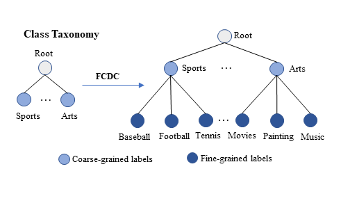
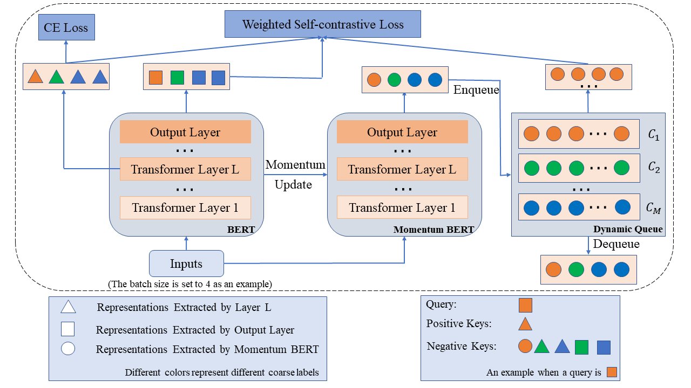
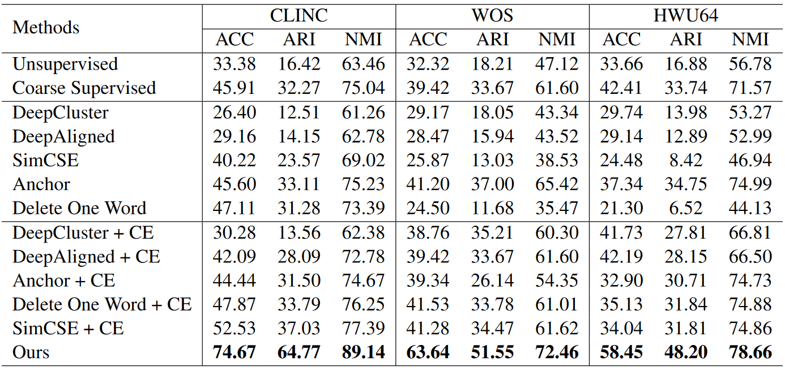

# Hierarchical Weighted Self-contrastive Learning
Data and code for paper titled [Fine-grained Category Discovery under Coarse-grained supervision with Hierarchical Weighted Self-contrastive Learning](https://arxiv.org/abs/2210.07733) (EMNLP 2022 Long paper)

*Fine-grained Category Discovery under Coarse-grained supervision (FCDC)* aims to discover novel fine-grained categories automatically based on the coarse-grained labeled data which are easier and cheaper to obtain.
<div align=center>

</div>


## Contents
[1. Data](#data)

[2. Model](#model)

[3. Requirements](#requirements)

[4. Running](#running)

[5. Results](#results)

[6. Thanks](#thanks)

[7. Citation](#citation)

## Data
We performed experiments on three public datasets: [clinc](https://aclanthology.org/D19-1131/), [wos](https://arxiv.org/abs/1709.08267) and [hwu64](https://arxiv.org/abs/1903.05566), which have been included in our repository in the data folder ' ./data '.

## Model
Our model mainly contains three  components: BERT, Dynamic Queue and Momentum BERT.
<div align=center>

</div>

## Requirements
* python==3.8
* pytorch==1.10.0
* transformers==4.19.2
* scipy==1.8.0
* numpy==1.21.6
* scikit-learn==1.1.1

## Running
Training and testing our model through the bash scripts:
```
sh scripts/run.sh
```
You can also add or change parameters in run.sh. (More parameters are listed in init_parameter.py)

## Results
<div align=center>

</div>
It should be noted that the experimental results may be slightly different because of the randomness of clustering when testing.

## Thanks
Some code references the following repositories:
* [DeepAligned](https://github.com/thuiar/DeepAligned-Clustering)
* [SimCSE](https://github.com/princeton-nlp/SimCSE)
* [MoCo](https://github.com/facebookresearch/moco)
* [SupContrast](https://github.com/HobbitLong/SupContrast)

## Citation
If our paper or code is helpful to you, please consider citing our paper:
```
@inproceedings{an-etal-2022-fine,
    title = "Fine-grained Category Discovery under Coarse-grained supervision with Hierarchical Weighted Self-contrastive Learning",
    author = "An, Wenbin  and
      Tian, Feng  and
      Chen, Ping  and
      Tang, Siliang  and
      Zheng, Qinghua  and
      Wang, QianYing",
    booktitle = "Proceedings of the 2022 Conference on Empirical Methods in Natural Language Processing",
    year = "2022",
    address = "Abu Dhabi, United Arab Emirates",
    publisher = "Association for Computational Linguistics",
    pages = "1314--1323",
}
```
